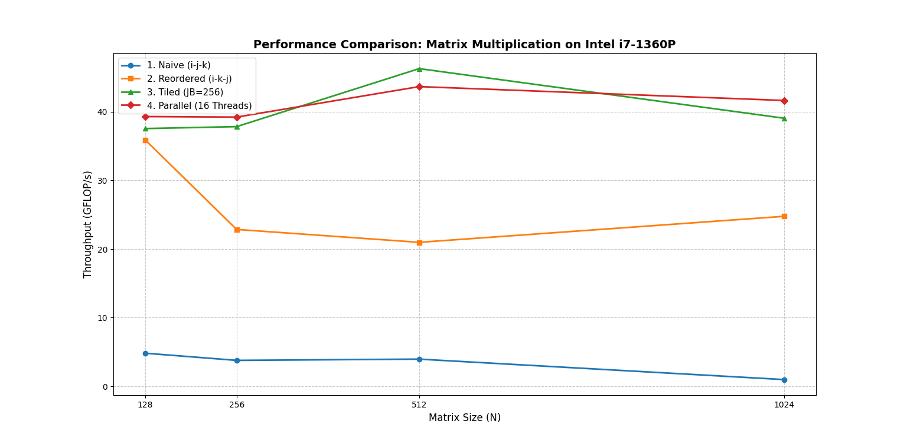

# Lab Report – Matrix Multiplication on CPU
**Course:** AI Accelerators (AIA)
**Lab:** Praktikum 1
**Team members:** _(Timo, Miriam, Hamzeh)_
**Date:** _(18.04.2026)_

---

## Task 1 – System Characterisation

> Fill in the details of your machine. Use tools such as `lscpu`, `lstopo`, `/proc/cpuinfo`.

On MacOS: sysctl -a | grep -E "hw\.|machdep\.cpu"

| Property | Value |
|---|---|
| CPU model | Apple M5 |
| Number of cores / threads | 10 / 10 (4 P-cores + 6 E-cores, no HyperThreading) |
| Base / Boost clock speed (GHz) | ~3.9 GHz / ~4.6 GHz (P-cores) |
| SIMD ISA (SSE4.2 / AVX2 / AVX-512 …) | ARM NEON (no SSE/AVX — ARM architecture) |
| SIMD width (bits / floats per vector) | 128 bits / 4 floats |
| MAC units per core | 4 FMLA units per P-core (NEON) |
| L1 cache size (per core) | 128 KB I-cache + 64 KB D-cache |
| L2 cache size (per cluster) | 16 MB (shared among 4 P-cores); 6 MB (shared among 6 E-cores) |
| L3 cache size (shared) | No traditional L3; ~28 MB System Level Cache (SLC) |
| RAM | 16 GB unified memory |
| Peak theoretical throughput (GFLOP/s) | ~147 GFLOP/s (P-cores only) |

**How did you calculate peak throughput?**

_(formula: cores × clock × SIMD_width × MACs_per_cycle)_
Calculation: 4 P-cores × 4.6 GHz × 4 floats × 2 (FMA = multiply + add) × 2 operations = ~147 GFLOP/s

---

## Task 2 – Loop Reordering

> Measure each loop ordering for matrix sizes 64, 128, 256, 512, 1024, 2048, 4096.

| Loop order | N=64 (GFLOP/s) | N=128 (GFLOP/s) | N=256 (GFLOP/s) | N=512 (GFLOP/s) | N=1024 (GFLOP/s) | N=2048+ |
|---|---|---|---|---|---|---|
| i-j-k (naive) | 2.36 | 1.92 | 2.90 | 3.10 | 2.06 | DNF |
| i-k-j | 11.85 | 16.68 | 35.82 | 37.42 | 36.74 | DNF |
| j-k-i | 2.29 | 1.97 | 0.81 | 0.71 | 0.51 | DNF |
| k-i-j | 12.19 | 32.96 | 33.97 | 34.06 | 32.65 | DNF |

**Best ordering found:** `i-k-j`

**Why does this ordering perform best?**

The `i-k-j` ordering performs best because it maximises spatial locality. In C, matrices are stored in row-major order. The innermost `j` loop accesses `B[k][j]` and `C[i][j]` sequentially (stride-1), so the CPU loads full cache lines and reuses them efficiently. By contrast, `j-k-i` is the slowest because its innermost `i` loop strides across rows in both `A` and `C` (stride-N), causing a cache miss on nearly every access.

---

## Task 3 – Vectorization

> List the compiler flags you tested and their effect.

| Flags added | N=1024 (GFLOP/s) | Speedup vs. baseline |
|---|---|---|
| -O3 only (baseline) | 36.34 | 1.00× |
| -O3 -march=native | 35.94 | 0.99× |
| -O3 -march=native -ffast-math | 35.67 | 0.98× |
| -O3 -march=native -ffast-math -funroll-loops | 35.71 | 0.98× |

**Did you add any `#pragma` hints to the source? If yes, which ones?**

No additional `#pragma` hints were added for these measurements.

**What speedup did you achieve? Why?**

Effectively **no speedup** was observed across all flag combinations — all results are within noise (~36 GFLOP/s). This is the opposite of what happens on x86 (like Timo's i7-1360P where `-march=native` unlocks AVX2 for a significant boost). On Apple M5 (ARM64), Clang already targets the native architecture at `-O3`, and there is no higher SIMD tier to unlock — NEON is always 128-bit. `-ffast-math` and `-funroll-loops` also had no measurable effect, suggesting the compiler already makes the same decisions automatically.

---

## Task 4 – Loop Tiling

> Experiment with tile sizes to find the sweet spot for your cache hierarchy.

| Tile size | N=512 (GFLOP/s) | N=1024 (GFLOP/s) | N=4096 (GFLOP/s) |
|---|---|---|---|
| 32  | 99.86 | 95.76 | |
| 64  | 121.74 | 115.60 | |
| 128 | 161.15 | 145.32 | |
| 256 | 127.93 | 149.83 | |

**Best tile size:** `128`

**Why does this tile size work best for your machine?**

My L1 cache has 64 KB so a tile size of 128 KB leads to a spillover to L2 while a tile size of 64 KB fits perfectly. 128 KB is still faster than 64 KB because the L2 cache is verly large and fast and JB=128 has a higher arithmetic intensity; for each cache miss you do 4x more FLOPs 

---

## Task 5 – Multithreading

> Measure scaling as you increase the number of OpenMP threads.

| Threads | N=1024 (GFLOP/s) | Speedup vs 1 Thread |
|---|---|---|
| 1 | 32.79 | 1.00× |
| 2 | 63.62 | 1.94x |
| 4 | 122.95 | 3.75x |
| 8 | 141.70 | 4.32x |
| 10 (max threads) | 134.96 | 4.12x |

**Does throughput scale linearly with threads? Why / why not?**

No, because threads share the memory bus and the caches

---

## Task 6 – Performance Analysis

**Is your implementation compute-bound or memory-bound?** Justify with arithmetic intensity (FLOPs / bytes).

Naive: clearly memory-bound (AI ≈ 0.25, far left of ridge point)
Tiled (JB=128 or 256): AI of 32–64 FLOPs/byte is well above the ridge point → compute-bound

**Comparison vs. PyTorch (N=1024):**

| Implementation | GFLOP/s | % of PyTorch |
|---|---|---|
| Naive C | 2.06 | |
| Best optimised C | 157.32 | |
| PyTorch (CPU) | 1631 | 100.0% |

**What is the gap and why does it exist?**

157 GFLOPS (the parallel C) vs. 1631 GFLOPS (PyTorch) — ~10× difference.
The gap exists because hardware acceleration (AMX) and hand-written BLAS are simply inaccessible to plain C with OpenMP. 

---

## Task 7 – Key Takeaways

I got to know how my MacBook works a little bit more.
- how to implement a matrix multiplication
- how to calculate FLOPs

---

## Figures

> Place your performance plots (GFLOP/s vs. matrix size) in the `figures/` folder and reference them here.

